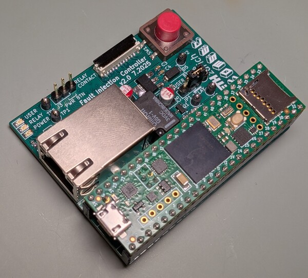

# RDIMM DDR5 Injection controller
Hardware design files and firmware for the injection controller PCB that
controls the DDR5 RDIMM interposer by using a Teensy 4.1 microcontroller. This is
a 2-layer PCB.

This is v2 of the [REFault injection controller](https://github.com/refault-artifacts/injection-controller).
The versions are mostly compatible; some firmware changes may be necessary.

## Design
The schematic and PCB was designed in KiCAD. Open `hardware/injection-controller.kicad_pro` in KiCAD 9.0.2 or later to view the design files.
From there, you should be able to select the schematic and PCB layout.
You can find a BOM spreadsheet in `docs/bom`.

For convenience, you can also find a PDF version of the schematic in `docs/schematics.pdf`.

## Features

 - **Relay**: Meant for emulating the power button of the system-under-test for fully automated test setups.
 - **Button**: Button can be configured with a jumper as programmable user button or hard-wired to control the relay.
 - **Ethernet**: RJ45 Jack connected to the Ethernet header pins of the Teensy.
 - **Pluggable Teensy**: The Teensy microcontroller board is meant to be
 attached to the PCB by using headers, allowing for easy replacement and
 swapping of microcontroller.
 - **Status LED**: One power LED, one relay LED, and one user controllable LED on the board.
- **Flat flex connector**: By using a suitable flat flex cable, the controller
 can be easily connected to the DDR5 fault injector interposer.

## Manufacturing
The PCBs were manufactured by JLCPCB and were assembled by hand.
It is reasonable to also order a SMT stencil so soldering is easier.
The Gerber files needed for manufacturing are located at hardware/output.

### Manufactoring options
| Option  | Value   |
|---------|---------|
| Layers  |   2     |
| Dimension | 61 mm* 50.3 mm |
| Product Type | Industrial/Consumer electronics |
| Different Design | 1|
| Delivery Format | Single PCB|
| PCB Thickness | 1.6|
| Impedance Control | no|
| Layer Sequence ||
| PCB Color | Green|
| Silkscreen | White|
| Via Covering | Tented|
| Surface Finish | LeadFree HASL|
| Deburring/Edge rounding | No|
| Outer Copper Weight | 1|
| Gold Fingers | No|
| Flying Probe Test | Fully Test|
| Castellated Holes | no|
| Remove Order Number | No|
| 4-Wire Kelvin Test | No|
| Material Type | FR4-Standard TG 135-140|
| Paper between PCBs | No|
| Appearance Quality | IPC Class 2 Standard|
| Confirm Production file | No|
| Silkscreen Technology | Ink-jet/Screen Printing Silkscreen|
| Package Box | With JLCPCB logo |

## Assembly
Assembly can be done manually using a stencil, some solder paste and a hot air gun.

## License
Some parts of the PCB may be subject to copyright of third parties 
(e.g. 3D models provided by manufacturer).
Otherwise, the design is released under MIT License.

The KiCad symbol and footprint libraries for the Teensy microcontroller 
are taken from [here](https://github.com/XenGi/teensy_library) 
and [here](https://github.com/XenGi/teensy.pretty), respectively (MIT License).
