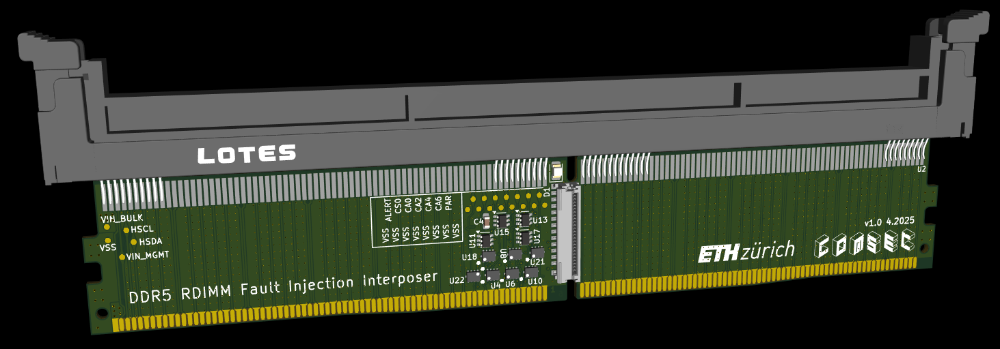
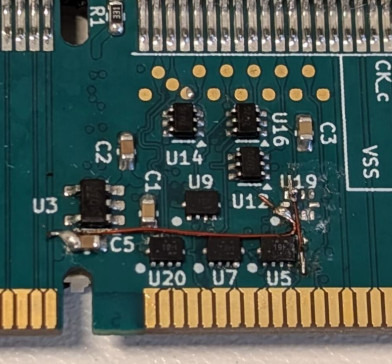

# RDIMM Interposer

This is an RDIMM variant of the [REFault](https://github.com/comsec-group/refault) [DDR5 fault injection interposer](https://github.com/refault-artifacts/fault-injection-interposer).
Like REFault, the RDIMM interposer supports faulting command/address lines (`CA0-6`).
Additionally, the two chip selects (`CS0` and `CS1`) can be swapped.
Unlike UDIMM, RDIMM has `ALERT_n` and `PAR_A` signals.
`ALERT_n` can be disconnected, leading to a suppressed signal.

With a simple hardware modification, it is also possible to entirely disconnect the `CS0` signal at will (without swapping it with `CS1`).

1. Remove the switch for `CS1` (U19).
1. Cut the trace `CS1_A_n_HOST`
1. Connect `CS1_A_n_HOST` to `CS1_A_n_DIMM`
1. Connect A1 (Pin 1) of U19 (which is connected to B1, Pin 3, of U18) to 1.1V.

Now, `CS1` should be permanently connected, while `CS0` is either connected normally, or the DIMM side is connected to +1.1V, depending on the state of `CS_SWAP`.
Even for single-rank DIMMs, `CS1` still needs to be connected for memory training.
This modification should be integrated into the next PCB revision.

The flat-flex connector is electrically compatible to the [REFault injection controller](https://github.com/refault-artifacts/injection-controller),
so only a firmware change is necessary.

## Mechanical
The mechanical dimensions of DDR5 UDIMMs and RDIMMs are specified in [JEDEC MO-329](https://www.jedec.org/system/files/docs/MO-329I.pdf).
Both variants are the same size and both of them have 288 pins.
They only differ by notch position.
See [docs/drawing.pdf](docs/drawing.pdf) for a mechanical drawing.

## PCB
The PCB was designed using KiCAD v9.0.1.

### Stackup
It has 6 layers and is impedance-controlled, as specified by
`JEDEC RDIMM Raw Card C Annex (JESD305-R8-RCC) v2.0`.
See [docs/drawing.pdf](docs/drawing.pdf) for detailed stackup and trace impedance information.

### Order Information
The PCB was ordered at JLCPCB.

| Option | Value |
|--------|-------|
|Base Material| FR-4|
|Layers| 6|
|Dimension| 133.35 mm* 22.51 mm|
|Product Type| Industrial/Consumer electronics|
|Different Design| 1|
|Delivery Format| Single PCB|
|PCB Thickness| 1.2mm|
|Specify Stackup| yes JLC06121H-1080|
|PCB Color| Green|
|Silkscreen| White|
|Material Type| FR-4 TG155|
|Via Covering| Epoxy Filled & Capped|
|Surface Finish| ENIG|
|Gold Thickness| 2U"|
|Deburring/Edge rounding| Yes|
|Outer Copper Weight| 1 oz|
|Inner Copper Weight| 0.5 oz|
|Gold Fingers| No|
|Electrical Test| Flying Probe Fully Test|
|Castellated Holes| no|
|Press-Fit Hole| No|
|Edge Plating| No|
|Mark on PCB| Order Number|
|Blind Slot| No|
|Min via hole size/diameter| 0.15mm/(0.25/0.3mm)|
|4-Wire Kelvin Test| Yes|
|Paper between PCBs| No|
|Appearance Quality| IPC Class 2 Standard|
|Confirm Production file| No|
|Silkscreen Technology| Ink-jet/Screen Printing Silkscreen|
|Package Box| With JLCPCB logo|
|Inspection Report| No|
|Board Outline Tolerance| ±0.2mm(Regular)|

